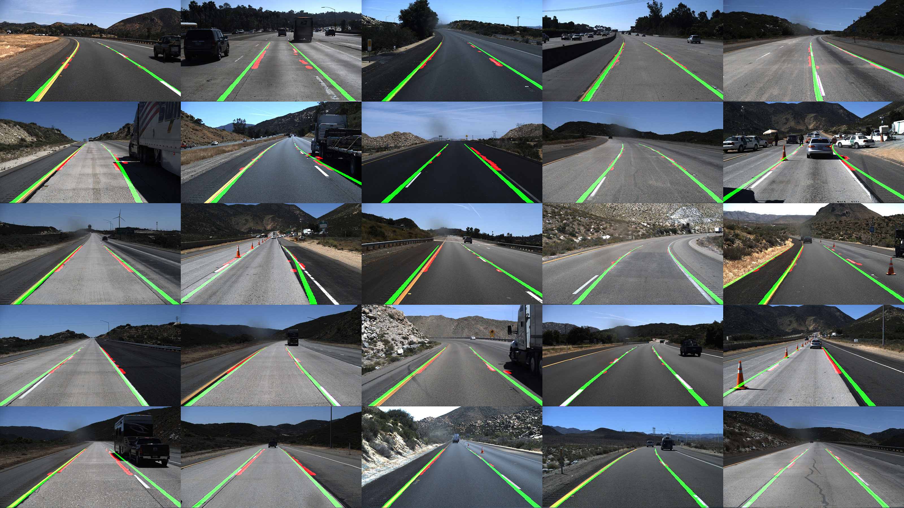

# Lane Detection from Video Clips Using  Binarization and Sliding Window




This repo contains the code and the report document of the final project in SUSTech EE326 digital image processing course (2021 Spring).

## Run the program

### Initialize the conda environment

```shell
cd code/
```

```shell
conda env create -f environment.yml
```

### Replace images

You can find the image you want to test and put it into `input_img` folder as the current format. We recommend using [TuSimple dataset](https://github.com/TuSimple/tusimple-benchmark) as the validation dataset.

### Run the code

```shell
python3 main.py
```

The output with overlaid lane mark will be appeared in `output_img` folder.

## View the report

Checkout the `document` folder.


